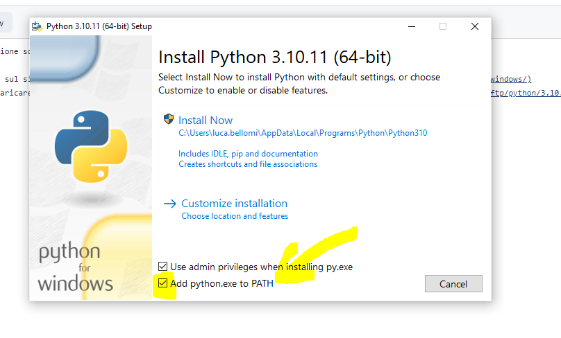

Installazione sotto windows:

1) andare sul sito ufficiale di python [https://www.python.org/downloads/windows/](https://www.python.org/downloads/windows/)
2) scaricaricare una versione stabile: per esempio l'[installer windows della versione 3.10](https://www.python.org/ftp/python/3.10.11/python-3.10.11-amd64.exe) ed eseguirlo. Flaggare "add python to path". Verrà installato contestualmente anche l'editor di base IDLE: 
3) riavviare windows
4) eseguire da cmd il comando 'python --versione'
5) stringhe e f-string
